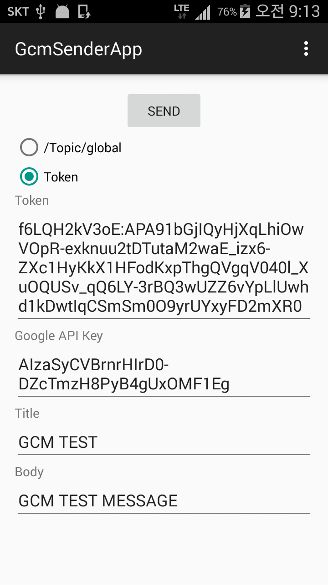
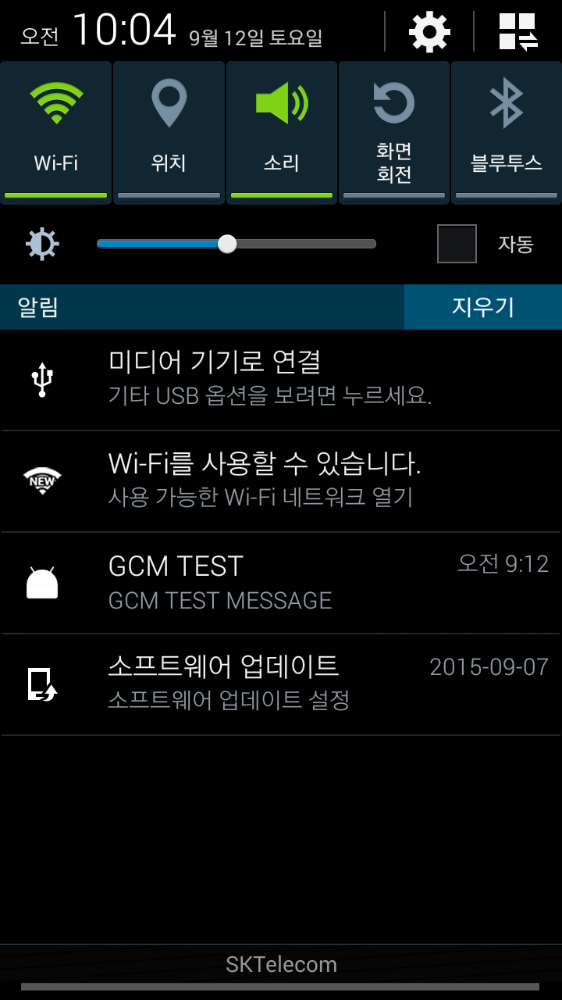

Google Cloud Messaging Quickstart With GcmSender App(Android)
=================================

Google Cloud Messaging Android Quickstart app demonstrates registering
an Android app for GCM and handling the receipt of a GCM message.
InstanceID allows easy registration while GcmReceiver and
GcmListenerService provide simple means of receiving and handling
messages.

Blog Post
-----------
http://zzisoo9.blog.me/220469401035

Screenshots
-----------

